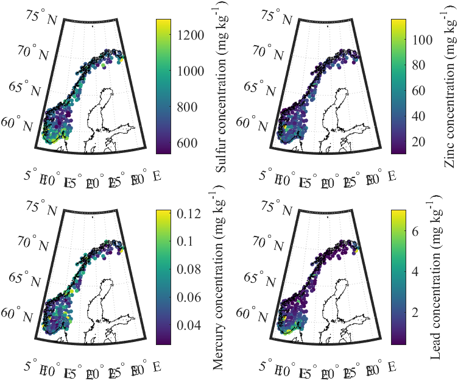

# Atmospheric deposition of heavy metals in Norway (2015)

## Summary 

Matlab scripts to extract and visualize data related to deposition of metal on dry moss in Norway. The EBAS database [1] hosted by thredds server by NILU is accessed. For additional information on the data, see [2].

## Dependencies

    MATLAB R2019b or later
    Mapping Toolbox

## Files

    - getData_from_Thredds.mlx: MATLAB live script for extracting data from the Thredds server 
    - moss_data.mat: data extracted with getData_from_Thredds.mlx
    - plot_results.mlx: MATLAB live script for visualizing the data extracted with getData_from_Thredds.mlx
    - world.mat: MATLAB mat file containing the coastline at a global scale

##  Usage

    Run getData_from_Thredds.mlx to extract the data from the Thredds server. The data will be saved in moss_data.mat.
    Run plot_results.mlx to visualize the extracted data. The script will load moss_data.mat and world.mat and generate scatter plots of the environmental data.
    The output plots will be saved as PDF files in the same directory.

## Acknowledgments

The environmental data was obtained from the EBAS database hosted on the Thredds server maintained by the Norwegian Institute for Air Research.

## Reference

[1] https://thredds.nilu.no/thredds/catalog/ebas/catalog.html

[2] Steinnes, E., Uggerud, H. T., Pfaffhuber, K. A., & Berg, T. (2017). Atmospheric deposition of heavy metals in Norway. National moss survey 2015. NILU rapport.

